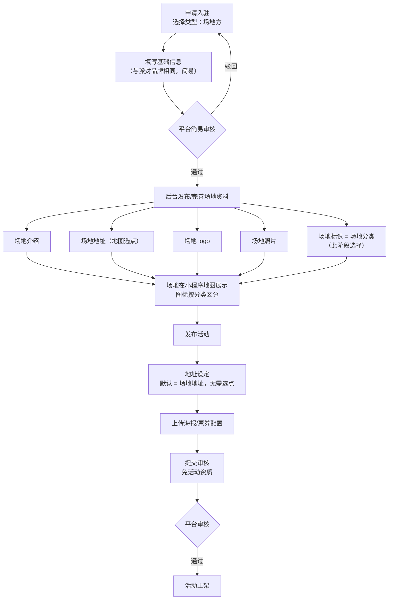
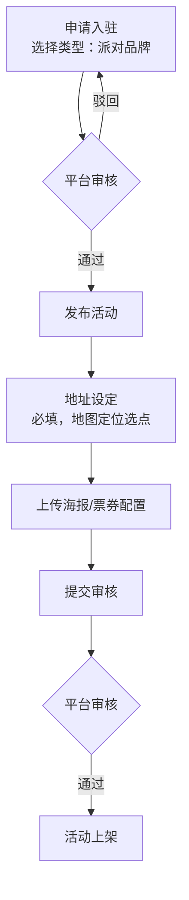

# HYPER 小程序「商家类型 × 场地」需求梳理（待客户确认）

> 整理日期：2026-08-15
> 目的：把近期群里零散讨论整理成一份可逐条确认的需求说明。请客户重点核对 **第 4 节流程图** 和 **第 6 节待确认问题**，逐条回复"确认 / 修改意见"即可。
> 参考资料：此刻霓虹管理后台 `https://account.neontech.cn/#/events/edit`（场地发活动流程参照对象）、蓝湖「地图图标」设计稿（34 个场地分类图标）。

---

## 1. 一句话概括

商家分两种类型，**入驻注册时就选定**：

- **派对品牌（主办方）**：只能发活动，发活动时必须填活动地址（地图定位选点）。
- **场地方**：= 主办方功能 + 一个固定在地图上的场地。发活动时**默认使用场地资料中的地址**，不需要重新选地址。

> 原话依据：「场地就是包含了主办方的功能」「主办方没有场地，只能发活动，但是发活动能定位」。

## 2. 两种商家的能力差异表

| 能力 | 派对品牌（主办方） | 场地方 |
| --- | --- | --- |
| 入驻审核 | 正常审核 | **简易审核**（入驻表单两种类型完全一致） |
| 拥有自己的场地主页/地图点位 | ❌ | ✅ 审核通过后需在后台**再次发布场地资料**才展示 |
| 发活动 | ✅ | ✅ |
| 发活动时填地址 | 必填（地图定位选点） | **默认 = 场地资料地址**，无需重选（参照霓虹后台的"默认/自定义"） |
| 活动资质（批文）上传 | 待确认（见 Q6） | **不需要**（已确认去掉） |
| 商家主页展示 | 只展示"活动" | 只展示"场地 + 活动" |

## 3. 场地的分类与地图图标

- 场地分类在**入驻审核通过后、发布场地资料时**选择（不在入驻申请阶段），分类决定该场地在小程序地图上的图标。
- 图标不能所有场地都是酒杯——场地有多种运营形态（车库、音乐基地、剧场、咖啡馆等）。
- 分类清单以蓝湖「地图图标」设计稿为准，共 **34 类**：

  演出、派对、活动、高尔夫、滑雪、滑板、篮球、足球、网球、台球、羽毛球、潮牌、咖啡/奶茶、垂钓、音乐、骑行、攀岩、露营、电竞、宠物、健身、拍照、棋牌、理发、游泳、汽车、机车、纹身、打卡、剧场、格斗/搏击、酒吧/场地、卡丁车、剧本杀/桌游

## 4. 流程图

### 4.1 场地方全流程

### 4.2 派对品牌（主办方）全流程

### 4.3 发布活动向导：霓虹后台参考 vs 我们的取舍

霓虹后台发布活动是 5 步，我们按商家类型裁剪：

| 步骤 | 霓虹后台字段（实测） | 场地方 | 派对品牌 |
| --- | --- | --- | --- |
| ① 活动信息 | 活动名称(80字)、分享标题(20字)、活动日期、强实名模式、未成年人校验、活动概要(富文本) | 保留 | 保留 |
| ② 地址设定 | 活动地址（**默认/自定义**切换）、省市区、详细地址、地点名称(选填)、地图选点 | **默认场地地址，无需选点** | 保留，必填 |
| ③ 上传海报 | 详情页海报(5:4)、详情长图(购票页底部)、列表及分享图(4:3)、**活动微信社群二维码** | 保留（社群码见 Q5） | 保留（社群码见 Q5） |
| ④ 票券配置 | 票种/票价/库存等 | 保留（见 Q3） | 保留 |
| ⑤ 活动资质 | 活动批文上传 | **去掉** | 待确认（见 Q6） |

## 5. 入驻申请表单（参照霓虹，待确认）

**我们现在的表单**（派对/场地完全一样的 4 项）：名称、入驻类型（派对/场地）、Logo 图片、所在地区（省/市/区，锁定成都）。

**霓虹的入驻表单**：主办 LOGO、主办名称、主办类型、主办简介、联系人姓名、客服信息（微信或手机号）、渠道来源、账户信息（手机号+密码）、提现信息（户名/卡号/银行支行）、服务协议勾选。

**建议方案（两种类型表单一致，保持简易，待确认）**：

| 字段 | 说明 |
| --- | --- |
| 名称 | 现有 |
| 入驻类型（派对/场地） | 现有 |
| Logo | 现有 |
| 所在地区 | 现有 |
| 主办简介 | 参照霓虹新增（选填） |
| 联系人姓名 | 参照霓虹新增 |
| 客服信息（微信/手机号） | 参照霓虹新增 |

> 场地分类、场地详细地址（地图选点）**不在入驻阶段填**——它们是"场地"本身的资料，在入驻审核通过后、商家在后台**发布场地资料**时填写（见第 4.1 节流程图）。

**不照搬霓虹的**：账户密码（我们是微信一键登录，不需要）、提现信息（入驻后在后台单独维护，已有"提现信息"页面）、渠道来源（可选，见 Q13）。

## 6. 与现状的关系（开发侧备注，客户可忽略）

- 已完成：场地发布向导去掉活动资质步骤；商家主页按类型区分展示（取 organizers 表的 name/logo）；场地资料编辑后二次审核（快照延后发布）。
- 进行中/待开发：场地分类与地图图标、场地资料发布表单（介绍/地址/logo/照片/标识）、场地方发活动默认地址、派对品牌地址必填定位。

## 7. 待确认问题（请逐条回复）

- **Q1 场地分类清单**：第 3 节的 34 个分类是否全部启用？是否需要排序、删减或增加"其他"？
- **Q2 场地方发活动的地址**：默认用场地地址后，是否仍允许临时改成别的地址（霓虹后台保留了"默认/自定义"切换）？还是完全锁定？
- **Q3 票价必填问题**：LICHEE 实测"用场地方发的活动没填票价"也发出去了。发活动时票券配置是否必填？免费活动如何处理（0 元票 / 不需票）？
- **Q4 场地资料修改**：场地资料（介绍/logo/照片等）修改后是否需要重新审核？（当前实现：已上架场地编辑后需二次审核，审核期间线上保持旧版本）
- **Q5 活动微信社群二维码**：霓虹后台发布活动时可上传社群二维码，我们是否也要？
- **Q6 派对品牌的活动资质**：场地方已确认免活动资质，派对品牌发活动时是否保留资质上传（选填/必填/也不要）？
- **Q7 场地标识**：第 4.1 节把"场地标识"理解为"入驻时选择的分类（决定地图图标）"，是否正确？还是指需要单独上传一个标识图片？
- **Q8 存量数据**：已入驻的商家（如 HYPER赛事中心）归为哪种类型？由平台后台直接指定，还是需要商家重新走一遍流程？
- **Q9 场地详情页**：场地在地图/列表点进去后的"场地详情页"，展示内容是否就是 场地介绍 + 照片 + 该场地的活动列表？（蓝湖有历史设计稿「场地详情页」，是否沿用？）
- **Q10 入驻表单字段**：第 5 节的建议方案（两种类型一致：现有 4 项 + 主办简介/联系人/客服信息）是否可以？这三项新增字段必填还是选填？
- **Q11 场地地址与分类的填写时机**：已按"入驻后发布场地资料时才填"理解，对吗？场地地址是否需要地图选点记录经纬度？（地图图标展示 + 发活动默认地址都依赖坐标，建议要）
- **Q12 提现信息**：入驻时必填，还是入驻后商家在后台自行补充？（现状：后台已有单独的提现信息页）
- **Q13 渠道来源**：霓虹入驻表单里有"通过什么渠道知道我们的"，我们要不要这个字段？
